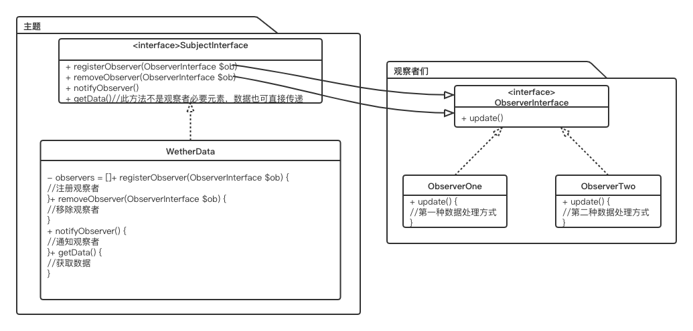

# 观察者模式

在对象之间定义一对多依赖，这样一来，当一个对象改变状态，依赖它的对象就会收到通知，并自动更新。  
主题用一个共同的接口来更新观察者，观察者和主题之间采用松耦合方式结合  
使用此模式，获取数据的方式采用推拉都可以，如果各观察者所使用的数据大致相同，推的方法更合适，如果差异很大，拉的方式更好一些(个人认为)  

## 书中的例子

  

## 解决的问题

解耦对象间的依赖

## 原理

1、针对接口编程，不针对实现编程
2、多用组合，少用继承
3、为交互对象之间的松耦合设计而努力

[源码](https://github.com/cboy868/patterns)