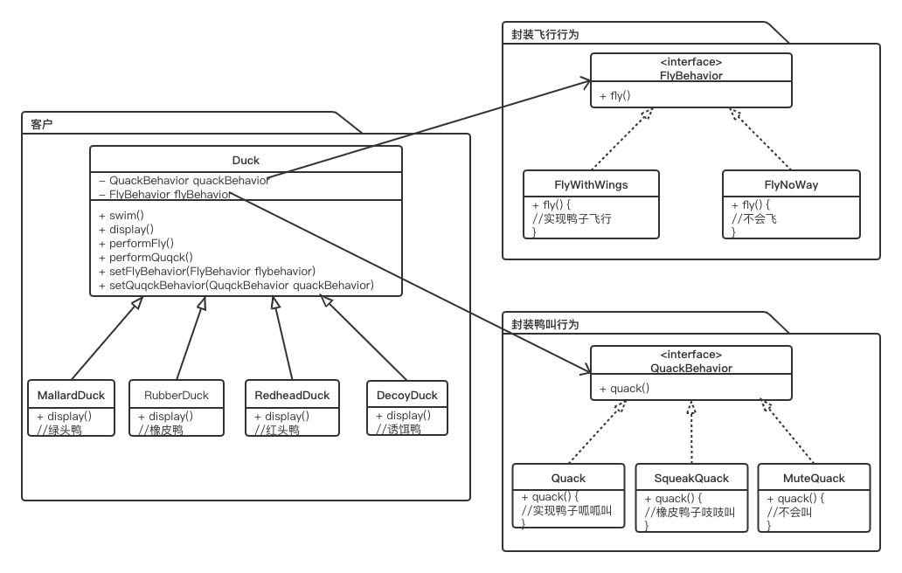

# 策略模式

其定义了算法族，分别封装起来，让他们之间可以互相替换，此模式让算法的变化独立于使用此算法的客  

## 书中的例子

  

## 解决的问题

如果此类换做继承实现，以飞行方式来说，  
1、代码在多个子类中重复，无法实现复用  
2、运行时，鸭子行为无法改变，因为已经写死在子类中  

## 原理

1、找出在未来应用中，可能会变化的地方，把他们抽象出来，和不变的代码分开。  
2、少用继承，多用组合

## 注意

要建立可维护的OO系统，要诀就在于随时想到系统以后可能需要的变化以及应付变化的原则  

[源码](https://github.com/cboy868/patterns)