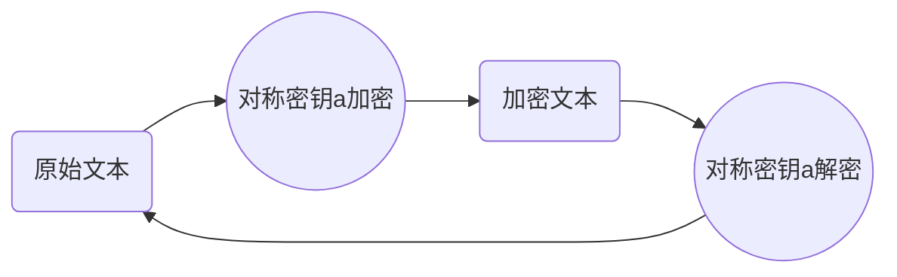
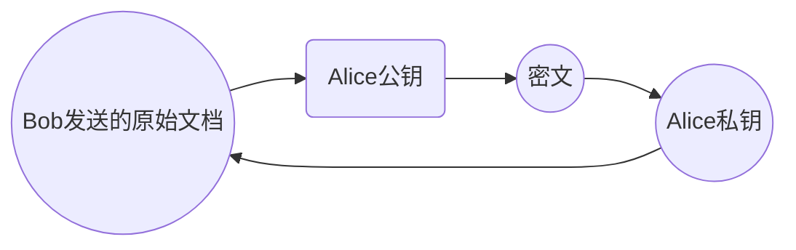

# 对称加密与非对称加密区别

对称加密，性能高

```mermaid
graph LR;
  A(原始文本) --> B((对称密钥a加密)) -->C(加密文本)-->D((对称密钥a解密))-->A(原始文本)
```

非对称加密，性能差很多，安全性较高

```mermaid
graph LR;
  A((Bob发送的原始文档))-->B(Alice公钥)-->C((密文))-->D((Alice私钥))-->A
```

