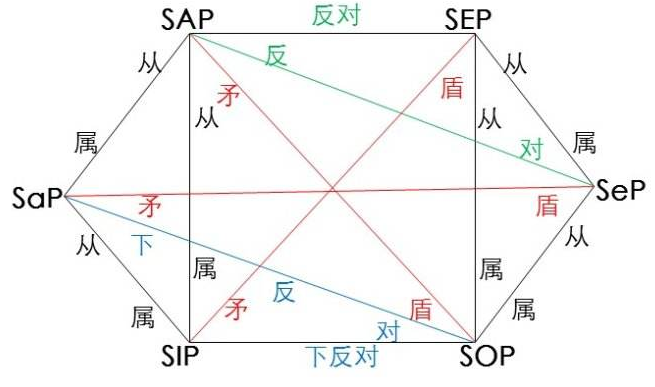

# 直言命题

## 直言命题对当关系注意
1. 同素材
1. 主项存在预设
1. 矛盾关系优先
1. 对当关系命题与实际命题的真假可能不一致

## 直言命题对当关系直接推理

矛盾关系  
1. SAP &hArr; ^SOP
1. SEP &hArr; ^SIP
1. SIP &hArr; ^SEP
1. SOP &hArr; ^SAP

反对关系  
1. SAP &rArr; ^SEP
1. SEP &rArr; ^SAP

下反对关系  
1. ^SIP &rArr; SOP
1. ^SOP &rArr; SIP

差等  
1. SAP &rArr; SIP
1. SEP &rArr; SOP
1. ^SIP &rArr; ^SAP
1. ^SOP &rArr; ^SEP

## 直言三段论

> 三个词项(小项:S,中项M,大项P)，两次重复

要点
1. 包含单称命题做前提或结论的推理不是直言三段论
2. 非直言命题做推理的不是直言三段论
3. 包含4个项的不是

成立条件：
1. 都是标准直言命题
1. 三个直言必按大前提，小前提，结论的顺序排列

公理与规则
1. 中项在前提中至少要周延一次
1. 前提中不周延的项，结论中不得周延
1. 两个否定的前提，得不出结论
1. 如有一前提为否定，则结论必否定
1. 如果结论否定，则必有一前提为否定
1. 两个全称前提不能得出特称结论(有空概念时要加此判断)

