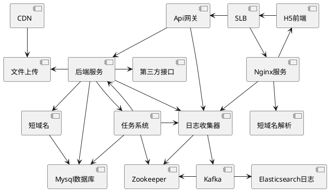



```plantuml
@startuml

[SLB]
[CDN]
[Api网关]
[后端服务]
[短域名]
[短域名解析]
[Nginx服务]
[文件上传]
[H5前端]
[任务系统]
[日志收集器]
[Zookeeper]
[Kafka]
[Mysql数据库]
[第三方接口]
[Elasticsearch日志]

CDN --> 文件上传
SLB <- H5前端
Api网关 <- SLB
SLB --> Nginx服务
Api网关 --> 后端服务
Api网关 --> 日志收集器
Nginx服务 --> 日志收集器
H5前端 <- Nginx服务
Nginx服务 --> 短域名解析
后端服务 -> 第三方接口
后端服务 --> 日志收集器
后端服务 -left-> 文件上传
后端服务 --> 任务系统
后端服务 <-- 任务系统
后端服务 --> 短域名
后端服务 --> Mysql数据库
任务系统 --> Zookeeper
任务系统 -> 日志收集器
任务系统 --> Mysql数据库
短域名 --> Mysql数据库
日志收集器 --> Zookeeper
日志收集器 --> Kafka
Zookeeper <- Kafka
Kafka -> Elasticsearch日志

@enduml
```
